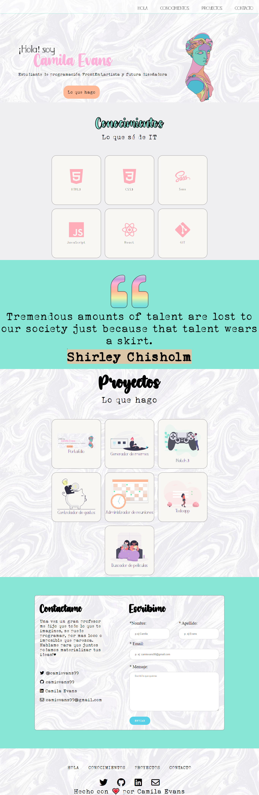

# Portafolio personal

### Este proyecto esta hecho con HTML5 y CSS3 como trabajo final de modulo-01 del curso del FrontEnd de ADAITW. Si bien esta en su forma final, proximamente se le agregaran proyectos nuevos. Decidi utilizar como base tonos blancos y grises y destacar lo importante con colores bastante llamativos en tonalidades pasteles,tambien jugar mucho con las transparencias y las transiciones lentas para darle el aspecto delicado que estaba buscando. 

<br>

***

### Para poder visualizarlo puedes seguir este [enlace](camievans99.github.io/portfolioada/) o este [otro]()

<br>

***

### Para poder tener este codigo en tu computadora y manipularlo como quieras, deberas seguir estos pasos en tu terminal


- Ir al [repositorio](https://github.com/camievans99/PortfolioAda)

- Darle click al botón de forkear

- Darle click al botón de code

- Copiar la url

- Abrir tu terminal y poner el comando de  ```git clone <url>```

- Entrar a la carpeta del proyecto y abrirlo en tu IDE

<br>

***

### POR AHORA, este proyecto no necesita la instalación de ninguna dependencia

<br>

***

### Asi deberia verse el Portafolio




<br>

***


### Este es mi primer gran proyecto, hecho con muchisimo amor, mucha dedicación, mucha paciencia y sobre todo con mucho apoyo y sororidad de mis compañeras de la 6ta de FrontEnd de ADA y mis profes [Jonh](https://github.com/Jonhks) y [Leydy](https://github.com/leydyk93/) que se bancaron muchisimas consultas a cualquier hora, cualquier dia y siempre estuvieron ahi ayudandome. Gracias a todxs ellxs y a mi familia hermosa que me banca y apoya como nadie

***
<br>

#### Con todo el 💜 del mundo, hecho por Camila Evans, para todxs.